# RKH's Content Creation Program - Process Flow Diagrams

## Document Information
- **Project**: RKH's Content Creation Program (CCP)
- **Version**: 1.0.0
- **Date**: September 24, 2025
- **Purpose**: Process flow diagrams supporting user stories
- **Target Audience**: Developers, Product Managers, QA Engineers

---

## Table of Contents
1. [Order Management Process](#order-management-process)
2. [Authentication Process](#authentication-process)
3. [Sample Tracking Process](#sample-tracking-process)
4. [Kanban Workflow Process](#kanban-workflow-process)
5. [AI Content Generation Process](#ai-content-generation-process)
6. [Bulk Operations Process](#bulk-operations-process)
7. [Import/Export Process](#importexport-process)
8. [Digital Asset Management Process](#digital-asset-management-process)
9. [Scanner Integration Process](#scanner-integration-process)
10. [Notification Process](#notification-process)
11. [Desktop Application Launch Process](#desktop-application-launch-process)
12. [Feature Request Process](#feature-request-process)
13. [System Administration Process](#system-administration-process)

---

## Order Management Process

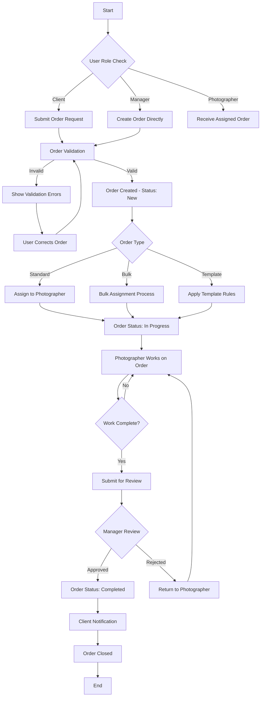

### Process Options:
- **Order Types**: Standard, Bulk, Template-based
- **Assignment Methods**: Manual, Automatic, Bulk
- **Review Process**: Single reviewer, Multiple reviewers, Skip review
- **Completion Options**: Auto-complete, Manual completion, Partial completion

---

## Authentication Process

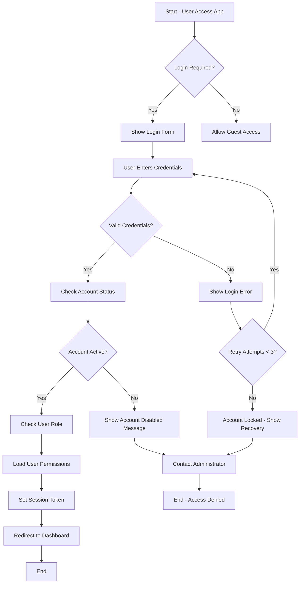

### Process Options:
- **Authentication Methods**: Username/Password, SSO, Multi-factor
- **Session Management**: Persistent, Timeout-based, Device-based
- **Recovery Options**: Email reset, SMS reset, Admin unlock
- **Guest Access**: Full access, Limited access, No access

---

## Sample Tracking Process

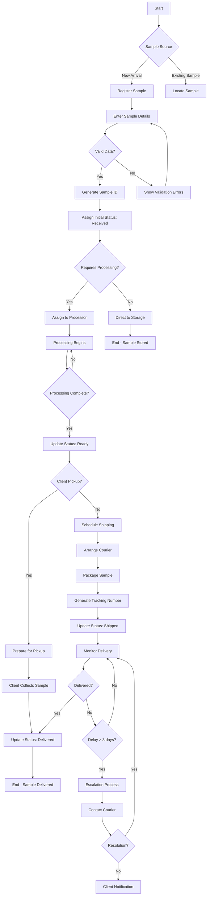

### Process Options:
- **Sample Types**: Physical samples, Digital samples, Mixed
- **Tracking Methods**: Manual updates, Barcode scanning, GPS tracking
- **Notification Levels**: Basic updates, Detailed tracking, Real-time alerts
- **Escalation Triggers**: Time delays, Location issues, Quality concerns

---

## Kanban Workflow Process

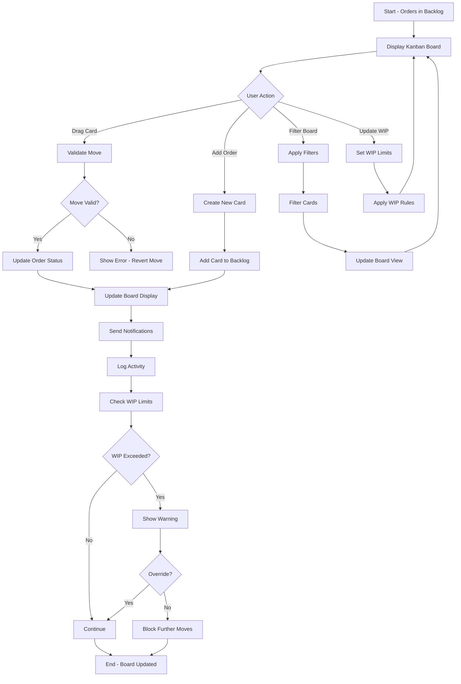

### Process Options:
- **Board Views**: Single board, Multiple boards, Personal boards
- **Card Actions**: Drag & drop, Quick edit, Bulk actions
- **WIP Enforcement**: Strict limits, Warnings only, No limits
- **Filtering Options**: By assignee, priority, due date, status

---

## AI Content Generation Process

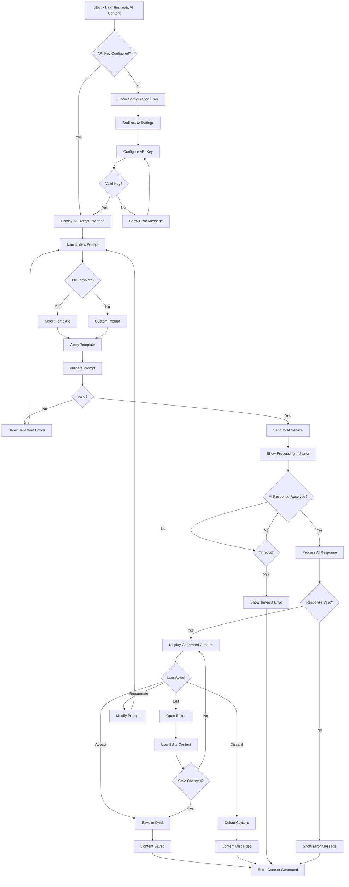

### Process Options:
- **AI Services**: Google AI (Gemini), Runware API, Multiple providers
- **Content Types**: Images, Text descriptions, Variations
- **Prompt Methods**: Free text, Templates, Guided prompts
- **Output Handling**: Auto-save, Manual review, Batch processing

---

## Bulk Operations Process

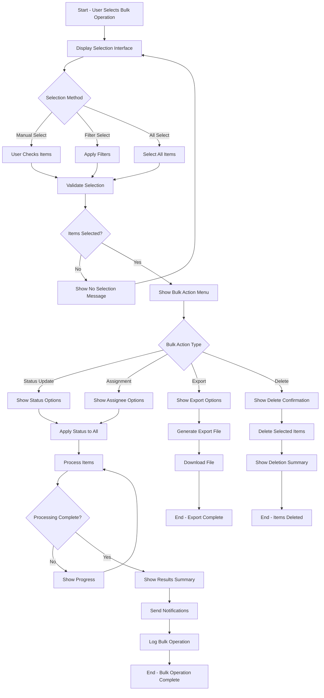

### Process Options:
- **Selection Methods**: Individual, Filtered, All items
- **Bulk Actions**: Status changes, Assignments, Exports, Deletions
- **Processing Modes**: Synchronous, Asynchronous, Background
- **Error Handling**: Stop on error, Skip errors, Rollback on failure

---

## Import/Export Process

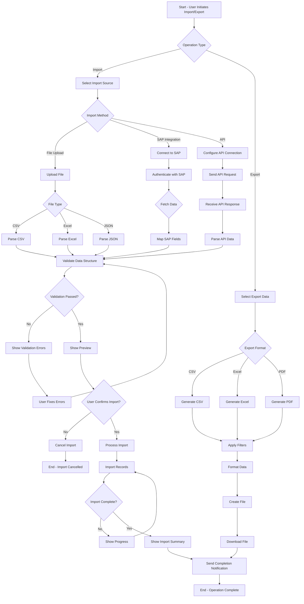

### Process Options:
- **Import Sources**: File upload, SAP integration, API feeds
- **File Formats**: CSV, Excel, JSON, XML
- **Validation Modes**: Strict, Lenient, Custom rules
- **Processing Options**: Preview mode, Direct import, Scheduled import

---

## Digital Asset Management Process

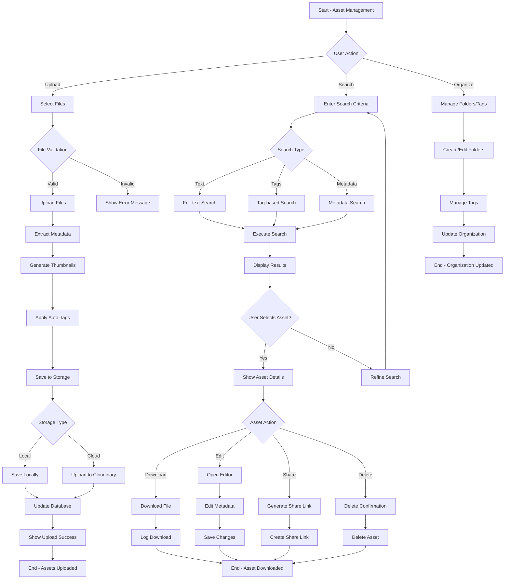

### Process Options:
- **Storage Options**: Local storage, Cloud storage, Hybrid
- **Organization Methods**: Folders, Tags, Metadata, Collections
- **Access Controls**: Public, Private, Role-based, Time-limited
- **Integration Options**: DAM API, Direct links, Embed codes

---

## Scanner Integration Process

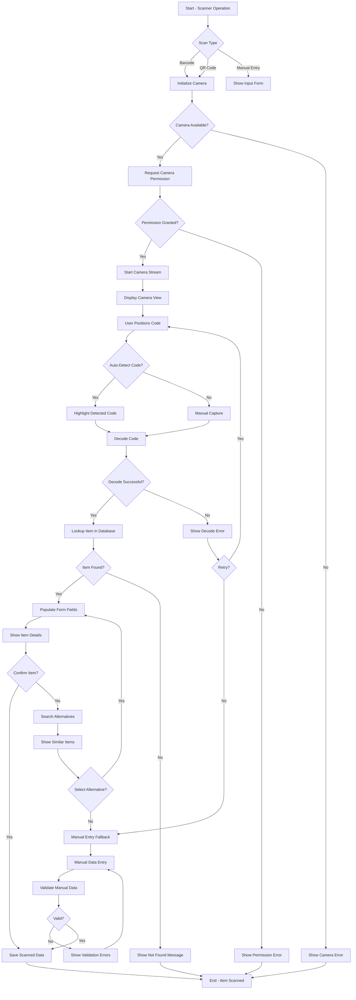

### Process Options:
- **Scan Types**: 1D barcodes, 2D codes (QR), Text recognition
- **Detection Methods**: Auto-detect, Manual capture, Continuous scanning
- **Fallback Options**: Manual entry, Search lookup, Skip scanning
- **Integration Points**: Order forms, Inventory systems, Asset tracking

---

## Notification Process

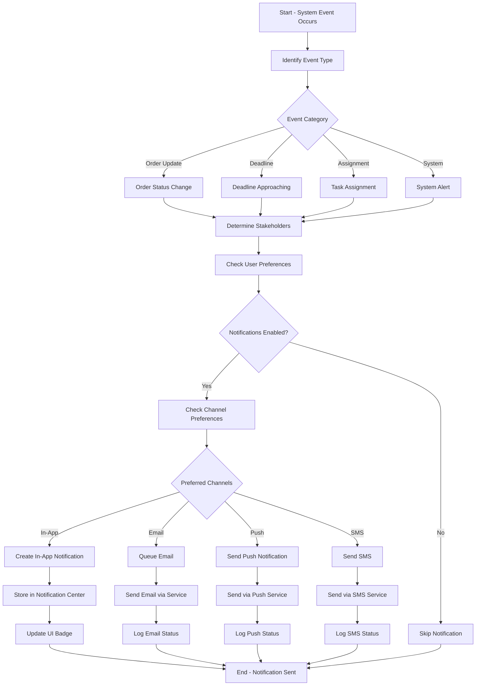

### Process Options:
- **Notification Types**: Real-time, Scheduled, Batched, Summary
- **Channels**: In-app, Email, Push notifications, SMS
- **Priority Levels**: Low, Normal, High, Urgent
- **Delivery Options**: Immediate, Delayed, Quiet hours respect

---

## Desktop Application Launch Process

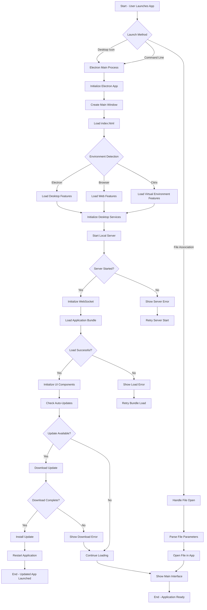

### Process Options:
- **Launch Methods**: Desktop shortcut, Command line, File association
- **Environment Detection**: Native desktop, Browser, Virtual (Citrix)
- **Update Strategies**: Automatic, Manual, Disabled
- **Error Handling**: Retry mechanisms, Fallback modes, User notifications

---

## Feature Request Process

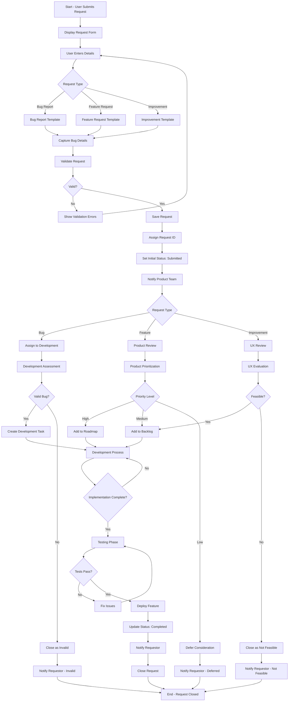

### Process Options:
- **Request Types**: Bug reports, Feature requests, Improvements
- **Review Processes**: Development review, Product review, UX review
- **Prioritization**: High, Medium, Low priority levels
- **Resolution Types**: Implemented, Deferred, Rejected, Invalid

---

## System Administration Process

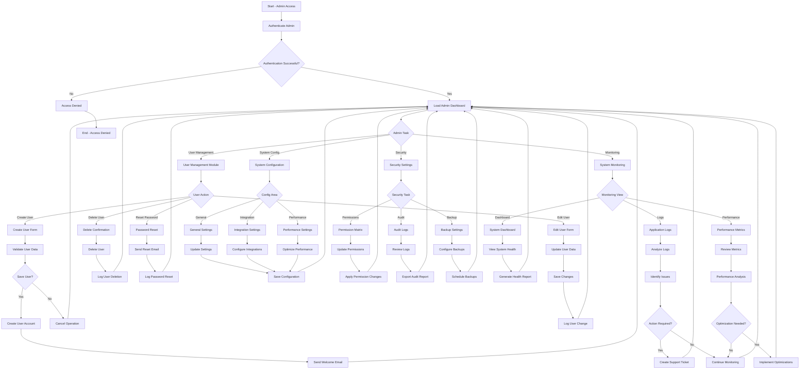

### Process Options:
- **Admin Tasks**: User management, System configuration, Security, Monitoring
- **User Operations**: Create, Edit, Delete, Password reset
- **Configuration Areas**: General, Integration, Performance settings
- **Security Tasks**: Permissions, Audit logs, Backup management
- **Monitoring Views**: Dashboard, Logs, Performance metrics

---

*These process flow diagrams provide detailed workflows for all major processes in RKH's Content Creation Program. Each diagram includes decision points, error handling, and alternative paths to support comprehensive implementation.*