# 📸 Photo Order Management Process Flow Chart

## Main Order Workflow States
Based on the status options array found in the codebase:

```javascript
const statusOptions = [
  'Draft',
  'New Request', 
  'Samples Requested',
  'In Progress',
  'Approved',
  'Complete',
  'Delivered'
];
```

## Parallel Sample Tracking States
Based on the samples data structure and status values:

```javascript
const sampleStatuses = [
  'Created',
  'At Photographer',
  'In Transit to Photo Box',
  'At Photo Box',
  'Sample Ready'
];
```

## Integrated Process Flow

```mermaid
flowchart TD
    %% Order Creation Phase
    START([📝 Order Creation]) --> DRAFT[📝 Draft Order]
    DRAFT --> REVIEW[👀 Order Review]
    
    %% Decision Point for Sample Requirements
    REVIEW --> DECISION{Requires Physical Samples?}
    DECISION -->|Yes| SAMPLES_REQ[📦 Samples Requested]
    DECISION -->|No| NEW_REQ[📋 New Request]
    
    %% Parallel Sample Tracking Process
    SAMPLES_REQ --> SAMPLE_CREATE[📦 Sample Created in Warehouse]
    SAMPLE_CREATE --> SAMPLE_ASSIGN[👨‍🎨 Sample Assigned to Photographer]
    SAMPLE_ASSIGN --> SAMPLE_TRANSIT[🚛 Sample In Transit to Photo Box]
    SAMPLE_TRANSIT --> SAMPLE_READY[📷 Sample At Photo Box]
    
    %% Order Progression Continuation
    NEW_REQ --> ORDER_IN_PROG[🎯 Order In Progress]
    SAMPLES_REQ --> ORDER_IN_PROG
    SAMPLE_READY --> ORDER_IN_PROG
    
    %% Final Workflow Steps
    ORDER_IN_PROG --> REVIEW_READY[👀 Ready for Review]
    REVIEW_READY --> APPROVED[✅ Order Approved]
    APPROVED --> COMPLETE[🎉 Order Complete]
    COMPLETE --> DELIVERED[🚚 Order Delivered]
    
    %% Parallel Content Creation
    ORDER_IN_PROG --> PHOTO_SHOOT[📸 Photo Shoot Execution]
    PHOTO_SHOOT --> CONTENT_UPLOAD[📤 Content Upload]
    CONTENT_UPLOAD --> REVIEW_READY
    
    %% Styling
    style START fill:#667eea,color:#ffffff
    style DRAFT fill:#f3f4f6,color:#374151
    style REVIEW fill:#e0f2fe,color:#075985
    style DECISION fill:#fef3c7,color:#92400e
    style SAMPLES_REQ fill:#fef3c7,color:#92400e
    style NEW_REQ fill:#e0f2fe,color:#075985
    style SAMPLE_CREATE fill:#f3f4f6,color:#374151
    style SAMPLE_ASSIGN fill:#dbeafe,color:#1e40af
    style SAMPLE_TRANSIT fill:#fef3c7,color:#92400e
    style SAMPLE_READY fill:#e0e7ff,color:#3730a3
    style ORDER_IN_PROG fill:#dbeafe,color:#1e40af
    style PHOTO_SHOOT fill:#dbeafe,color:#1e40af
    style CONTENT_UPLOAD fill:#dcfce7,color:#166534
    style REVIEW_READY fill:#dbeafe,color:#1e40af
    style APPROVED fill:#dcfce7,color:#166534
    style COMPLETE fill:#d1fae5,color:#065f46
    style DELIVERED fill:#d1fae5,color:#065f46
```



## Detailed Process Flow with Sample Coordination


## Process Flow States & Progress Tracking

| **Order Status** | **Progress %** | **Sample Status** | **Description** |
|------------------|----------------|-------------------|-----------------|
| **Draft** | 10% | N/A | Initial order creation |
| **New Request** | 20% | N/A | Order submitted for processing |
| **Samples Requested** | 30% | Created → At Photographer | Sample coordination initiated |
| **In Progress** | 70% | At Photo Box → Ready | Active photo production |
| **Approved** | 85% | Complete | Quality review passed |
| **Complete** | 100% | Archived | All deliverables ready |
| **Delivered** | 100% | Returned/Archived | Final handoff complete |

## Key Workflow Triggers & Dependencies

### 🔄 **Sample-Dependent Triggers**
- **Order → "Samples Requested"** triggers sample creation in warehouse
- **Sample → "At Photographer"** enables preliminary setup
- **Sample → "At Photo Box"** allows order to proceed to "In Progress"
- **Order → "Complete"** initiates sample return/archival process

### ⚡ **Direct Workflow Triggers**
- **No samples required** → Direct progression to "In Progress"
- **Content upload** → Triggers review process
- **Quality approval** → Moves to "Complete" status
- **Client delivery** → Final "Delivered" status

## Sample Location Tracking


## Integration Points

### 🔗 **System Integrations**
- **SAP PMR**: Purchase group coordination, event ID tracking
- **DAM (Digital Asset Management)**: Final asset storage and delivery
- **Content Upload**: Photographer/Photo Box file submission
- **Comment System**: Real-time collaboration and feedback

### 📊 **Progress Calculation**
```javascript
function calculateProgress(status) {
  const progressMap = {
    'Draft': 10,
    'New Request': 20,
    'Samples Requested': 30,
    'In Progress': 70,
    'Approved': 85,
    'Complete': 100,
    'Delivered': 100
  };
  return progressMap[status] || 0;
}
```

This process flow ensures efficient coordination between order management and sample logistics, with clear visibility into both workflows through the integrated dashboard system.
